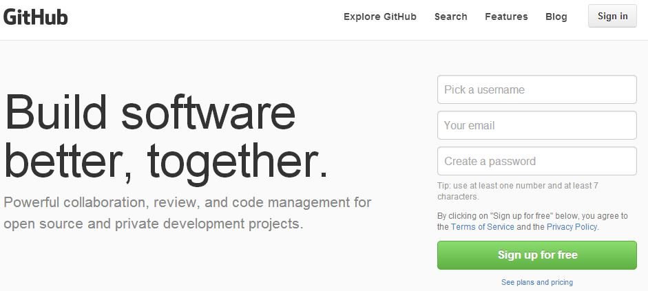
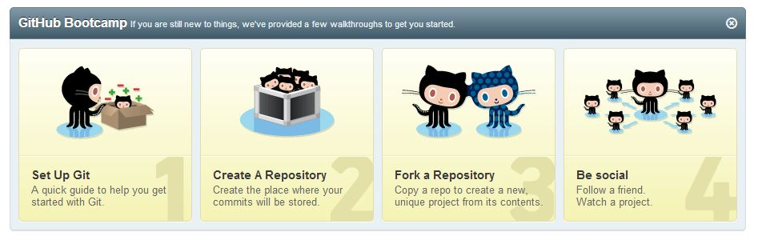
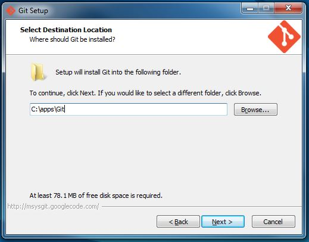
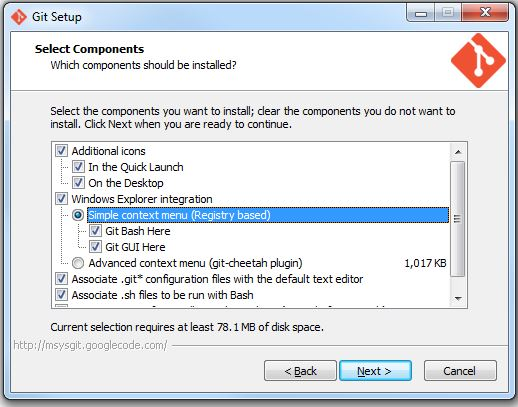

# Hack Your Programmer Career:
# Getting Your Foot in the Door with Test Case Automation

<a href="#license">Copyright / License Info</a>

## Chapter 1 
## Making a Beginning

This is a book about getting started in programming as a career. It's also a book about software testing and test automation. That may seem a bit strange to you, that a book about a career in programming would also be a book about software testing. You may well imagine that programming is creative and fun, a chance to solve problems all day long, right? Testing, on the other hand, is repetitive and tedious, and the folks in QA (Quality Assurance) are not the most popular guys on the team because they are the bringers of bad news. You might be thinking, "Shouldn't I be reading a book about something creative and fun, not something repetitive and tedious?"

Well, yes and no.

### Testing is Part of What Makes Programming Fun

First of all, implicit in the last paragraph is a sharp distinction between programming and testing that's really a little bit fuzzy the longer you examine it.  The software industry's move in recent years toward the idea of "agile programming" has brought with it a heavy emphasis on "test driven development" (TDD, with a capital TDD no less). The idea of test driven development is that as you're writing code you first write a small test that won't even compile or that fails, then you write just enough code to make that test pass, and you repeat throughout your project.

Test driven development doesn't give you the advantages of having a really great QA engineer pounding on your code, but what it does give you is:

* A suite of tests you can run before checking in new changes to the code, therefore helping you find bugs when they're easy to fix (because you just changed the code).

* Because you have this test suite, you gain a sort of reasonable confidence that you can make changes to the code without breaking anything. 

To me, the idea that programming is fun begins with that kind of confidence. In contrast, being asked to hack away (in the bad sense of hacking) at an untested body of code -- introducing new bugs and going back and fixing them again -- is the kind of fun I would save you from if I can.

### First Things First: Get the Job You Can Get

Paradoxically, another reason to focus on test automation as you're beginning your software career is precisely because programming is considered a relatively more "glamorous" job. In the move "A Beautiful Mind", there's a great scene in the bar room where John Nash (played by Russel Crowe) and some of his college buddies are in a bar, looking at three women they're hoping to take home. One of these women is a stunning blonde, clearly the most beautiful woman of the group, and Nash realizes that if they all go after the most beautiful woman, they'll alienate the other women and block each others efforts, whereas if they focus first on the less desirable ones, in Nash's words, they'll "all get laid."

The story of how John Nash learned to get laid is related to another story that didn't appear in the movies.

### How I Became a Programmer

About twenty-three years ago, I had a few things going for me. First, I was thirty, which I'm not any more. The other thing I had going for me twenty-three years ago was a Master of Arts degree, in, of all unlikely things, "The History and Philosophy of Science." 

If you don't have a degree in something like the History and Philosophy of Science, let me assure you: employers will not beat a path to your door.

However, because I also knew how to make certain modest things happen with a keyboard like being a power Word Processor and Spreadsheet user, I was able to get a job as an administrative assistant.I was making about $22,000 per year. $22,000 wasn't a lot of money then, and it's not a lot of money now, but I was happy to have it. That is, I was happy to have it until I started reading the want ads.

(That's right, go on, you can gasp or giggle a bit now if you want. I don't mind. When I was thirty, the Internet had hardly been invented, and people went looking for jobs from ads printed on dead trees. True story.)

When I started reading the want ads, I saw ads for computer programmers who knew skills like C, C++, and Windows. These jobs paid about $55,000 per year. Even with my wits dulled by a Masters Degree in the History and Philosophy of Science, I was still mathematically astute enough to be impressed by the significant difference between $22,000 and $55,000.

So I started to learn C, and C++, and Windows. To give my graduate degree its due, the thing it gave me (besides student loans) was the conviction that if I worked hard at learning something I could learn it. I read about C in the morning before work. I did the written exercises on my lunch break. I came home and tried things out on the compiler. When I finished my first two books on C, I started to learn Windows programming and C++.

### The Missing Insight

I had no idea how long it would take to break into the software industry, but as it turned out it took three. A friend of mine from graduate school (this degree is about to pay off) had gotten a job as a QA engineer, first in Indiana and later in Silicon Valley at Borland International, the same folks who made several of the compilers I had used to teach myself C and C++. My first job there was in technical support, helping folks with their usability problems on the C and C++ compiler. This was my entry level job. Two years later I had the job I started out to get –– software developer.

I might have gotten through this whole process quicker, but during the three years between beginning to learn programming and getting a job as a support engineer, I was focused on the programming job. Like all of John Nash's friends, I had my eyes on the blonde and was ignoring the other women in the room.

My missing insight was that not all jobs that let you do and learn programming are called programming jobs. In my case I was able to find a job called "Senior Tech Support Engineer", in which what I was Senior-Tech-Supporting was a programming language tool. This meant I got to continue writing sample code, but now I was getting paid for it. Sweet! And as if that didn't help me master my craft fast enough, part of my job was trying to answer questions from people with lots more experience than I had. 

Two years later I got the job I wanted as a programmer.

### Career Hacking Tip #1

If you want a job you're not yet qualified for, target your learning to another job that's __like__ that job you want, and that lets you do the job you want at least part of the time.

### Test Automation:  A Programmer's Answer to Career Hacking Tip #1

To understand why test automation is such a killer app for your resume, it helps to understand the difference between "black box testing" and white box testing".  In software testing, black box testing refers to testing the system without using knowledge of the software source code.  As the name suggests, black box testing means testing the system as a "black box" -- without any information about how the internals of the system work.
Usually, black box testing is focused on what is called "functional testing" -- testing the behavior (functionality) of a software against a specification for what the software should do.  Unless they're automating their tests or testing a software product that itself is a software delopment tool, black box testers don't need to have any kind of programming experience at all.

White-box testing, in contrast, tests the internal structure of an application. For examples, we've already mentioned test first development, in which programmers write the unit test for the software they're working on first, then write the software to make the unit test passed.  Such unit tests are a form of white box testing.  Similarly, integration testing may test how the various modules behave when they work together.

In general, then, white-box tests tend to be automated tests, whereas black box tests may either be manual or automated.  Although good black-box testers have many of the skills of programmers -- curiosity and a love for solving problems chief among them -- they don't necessarily need to be programmers to do their jobs.  This means that the level of programming skill for an entry level QA job is (on average), lower than the level of skill for an "entry level" programming job.

### Other Reasons To Learn Test Automation

The fact that the level of programming skill required to be a tester is lower than the level of programming skill required to be a programmer is one reason why test automation is a great skill to have if you haven't yet landed your first programming job. However, it isn't the only reason to consider learning how to automate tests and how to write unit tests in particular. Here are several more reasons why you should start unit testing now, even if you're just starting to learn programming:

* Unit tests are a great vehicle for code snippets.  You can't learn to swim without getting in the water, and you can't learn to program
without writing code -- lots and lots of code.  At the same time, the fact that you need to write lots and lots of code to learn how to program doesn't mean you're ready for a large project yet, but it does mean you need to experiment relentlessly on small snippets of code.  Unit tests
are a great tool for practicing your techniques on small, "demo" applications.  But don't worry -- as your programs grow in complexity, unit tests are a great tool for helping you keep them working well.

* Unit tests serve as a form of documentation. Anyone who's done any unit testing will likely attest to the fact that unit tests help developers and testers understand and document how pieces of the software should work. In recent years, the idea of Behavior Driven Devlopment and tools such as JBehave on Java and RSpec on Ruby have taken this idea a step further by allowing developers to express tests using a more natural sounding lanugage that -- if the hype is to believed -- can serve as a "common language" that can be understood by both businsess analysts and developers.

* Unit tests are a great tool for "driving" code in the debugger.  One of the curious things to me as a self-taught programmer is the extent to which introductory programming books ignore the use of the debugger as a tool of learning, exploration, and, well, let's face it -- debugging!

## Chapter 2
## Let's Git Going 

Almost all professional development teams -- and in any case all of the ones where going every day won't quickly start to feel like you're being water-boarded -- use some kind of software version control system. Version control systems have a number of major benefits:

* They make sure that multiple developers can work on all the files in the same project simultaneously, allowing changes to be merged seamlessly.

* They make sure that a given release (or version) of the software can be reliably built, even after the software has undergone subsequent changes.

* They allow you to track changes to the product, for example, to measure improvements over time.

* They allow you to compare one version of a file to another to see (for example)where a bug was introduced.

* They allow you to "roll back" -- undo changes to -- a single file, a set of files, or a whole project to an earlier state.

One version control system that's become quite popular in recent years is Git.Git works by letting you have your own full copy of your version control repository stored on your local machine. This allows remote teams to work independently without always being in touch with a central repository server. Because of this, Git has gained a rapid following on open source projects. Many of these are hosted on a very popular service, Github, which allows free accounts for open source projects and their contributors.

Having a Github account allows you to learn about how to use version control in a software team environment, but just as importantly, it allows you to demonstrate that you can use version control in a team environment.

### Career Hacking Tip #2

Programmers use version control software. Period. Showing up for a programming interview without knowing any kind of version control 
software is like showing up to a gunfight with a feather duster.

### Setting Up A GitHub Account

To get started using Github and Git, point your browser to [Github.com](http://www.github.com). There you'll see a sign up form where you can get started:

Pick a username you can live with (remember that you may show this to a future employer, so keep it clean and professional -- your name is a good choice), and enter your email address and password.

Once you've signed in by creating your account, you'll want to click the button that says Set Up Git.

On their [setup page](https://help.github.com/articles/set-up-git), you'll see you can either "Skip the Guide" by installing GitHub for Windows, or go through the Guide by clicking the link that says 
[Download and install the latest version of Git](http://git-scm. om/downloads).  I recommend clicking that link instead of using GitHub for Windows.  This will be a bit more work at first, but it will pay off in the long run.  Installing Git plus the Tortoise SVN Windows client will give you a great setup that includes some of the best command line tools plus what many consider to be the best GUI tool on Windows.

When prompted for a directory installing Windows apps -- not just for Git but in general -- I make a habit of installing to a directory without spaces, as it makes tools much easier to use from the command line.  I usually set up a root directory, "C:\apps" to put applications, instead of using the default "Program Files" directory, as shown below:

The next page will ask you to select components, including an option for Windows Explorer integration.  Here I recommend you select "Simple Context Menu", which will enable "Git Bash Here" and "Git Gui Here" as shown below.  

You can select "Use Git Bash Only" or "Run Git from the Windows Command Prompt" -- this is pretty much a matter of taste.  I usually go with "Use Git Bash Only".  On the dialog for configuring line endings, I usually accept the defaults.

Once Git is installed, there's one final step to make your life easier so you won't have to enter your user name and password every time you want to "push or pull" changes (syncronize a local repository with GitHub, or vice versa.  That is, you'll want to generate an SSH key and add it to Github.  Instructions on how to do that are located <a href="https://help.github.com/articles/generating-ssh-keys">here</a>.

### Your First Repository

Once you've configured GitHub for Windows, it will bring you to a page showing you that you have no repositories.  
To get a feel for Git, let's start by creating a local repository.

[TODO: More here]

### Get The Samples - Forking This Book

Because I want to make sure you have a chance to practice your Git skills before you get to the interview, and to make sure you always access to the latest samples I may work on, this book is available as a GitHub repository.  Remember that Git is a distributed version control system -- that means that there can be multiple, independent copies of the files for a project.  For example, I am currently typing this book on a file on my computer (currently README.md).  This file is also tracked by a repository I've created on Github: (https://github.com/JohnLockwood/HackYourProgrammingCareer)[https://github.com/JohnLockwood/HackYourProgrammingCareer].  

On my local machine, I have what is called a CLONE of the HackYourProgrammingCareer repository.  To show you how a checkin works, I'll do one now.

Opening up a "Git Bash" shell, from the root of the repository, I enter:

git commit -m"Working on the Forking This Book Chapter"

<a href="#license" /> This work is licensed under a <a rel="license" href="http://creativecommons.org/licenses/by-nc/2.0/">Creative Commons Attribution-NonCommercial 2.0 Generic License</a> All copies of this work must retain the following copyright notice and links intact:  <a href="https://github.com/JohnLockwood/HackYourProgrammingCareer">Hack Your Programming Career</a> Copyright 2013 John Lockwood and <a href="http://www.particlewave.com">ParticleWave.com<a>.

### Chapter 3 A Test First Learning Plan